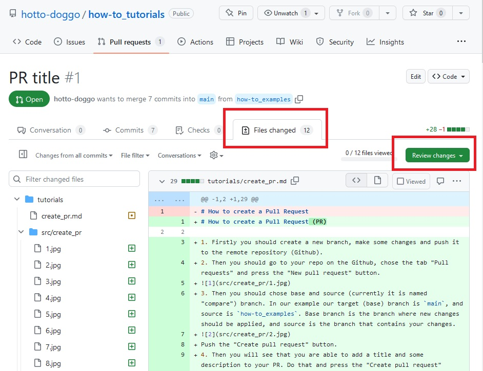
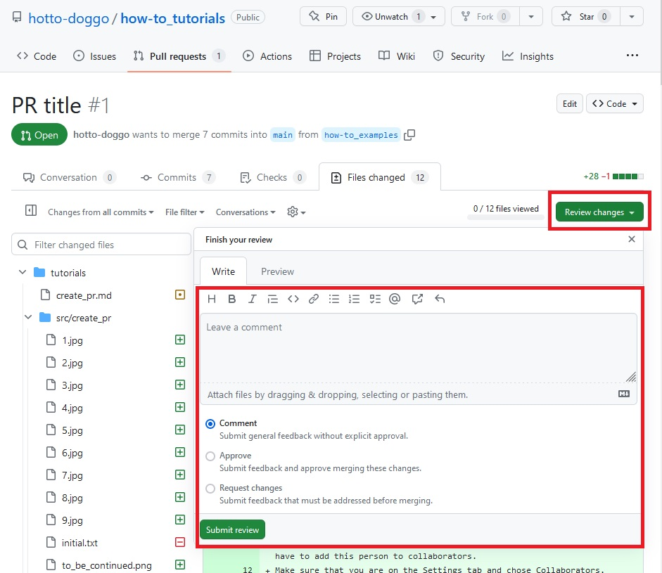
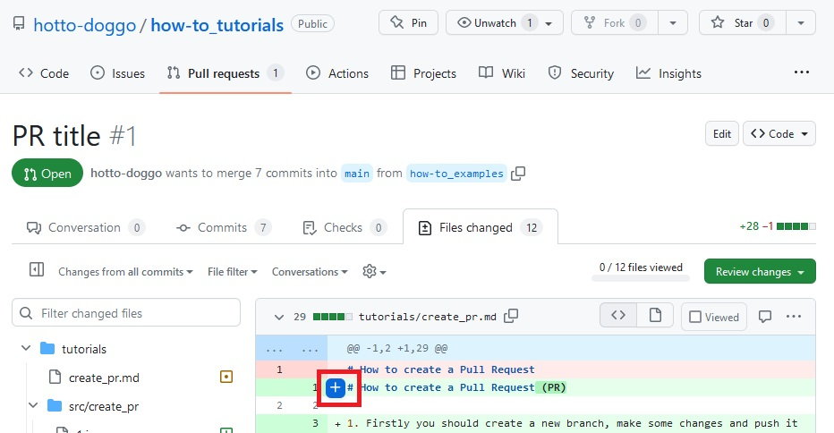
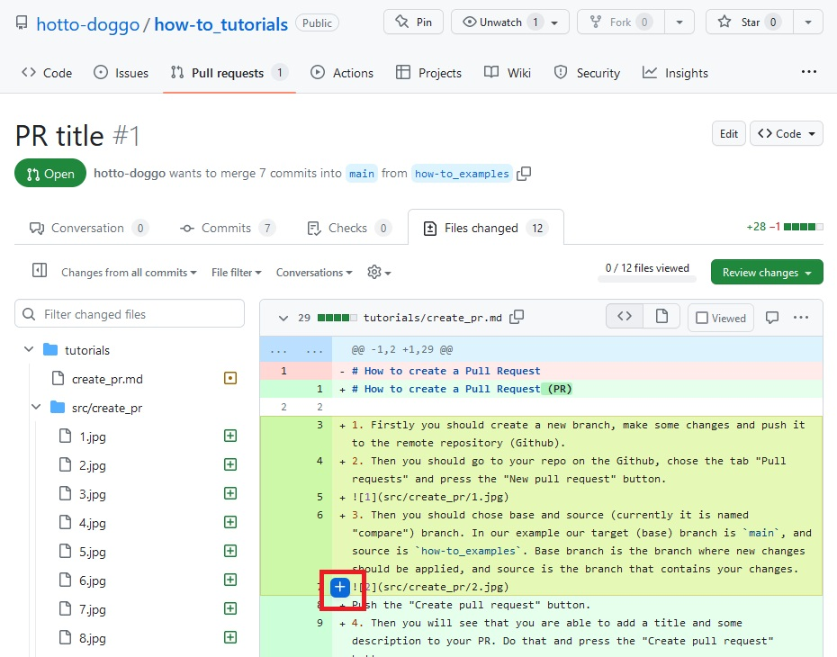
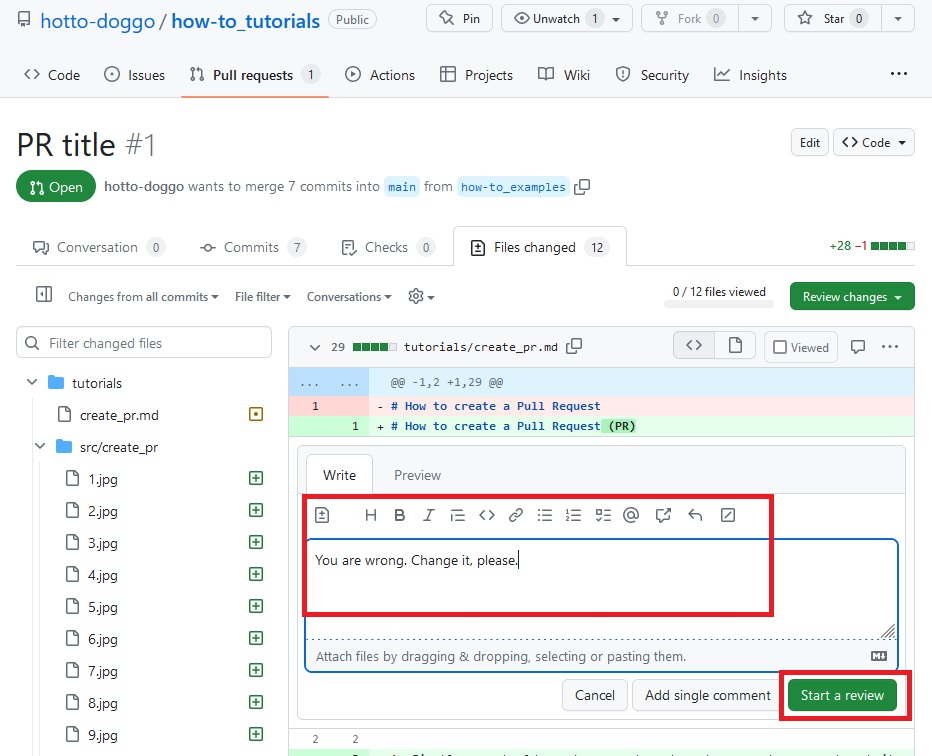
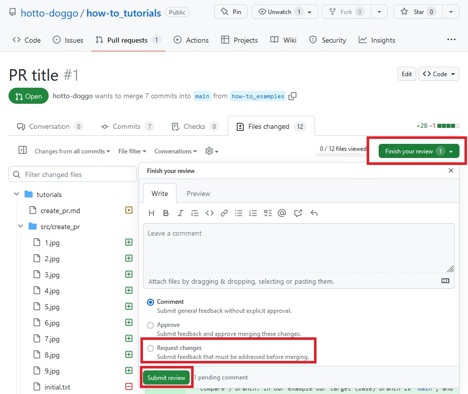

# How to review someone's code

So... You are a happy person that should review someone's code. Here are some steps that you should do:

1. Firstly you should go to the tab "Files changed" and press the button "Review changes".

2. Then you can either to approve PR or request some changes.

3. If you have no comments to the author you can just approve this PR. Also you can leave some message in box, for example "Everything looks good, great job!".
4. If you have some questions or change requests, you should do the following. Firstly you have to write some comments to the code. To write your comment you can select one or multiple line and press the `+` button.

5. Write some comments in the box and press "Start a review" button (in next comments this button will be named "Add a review comment"). 

6. When you finish your review you should press "Finish your review" button, select "Request changes" item and finally press "Submit review" button.

So you are done! You made great job!

*The end?*

