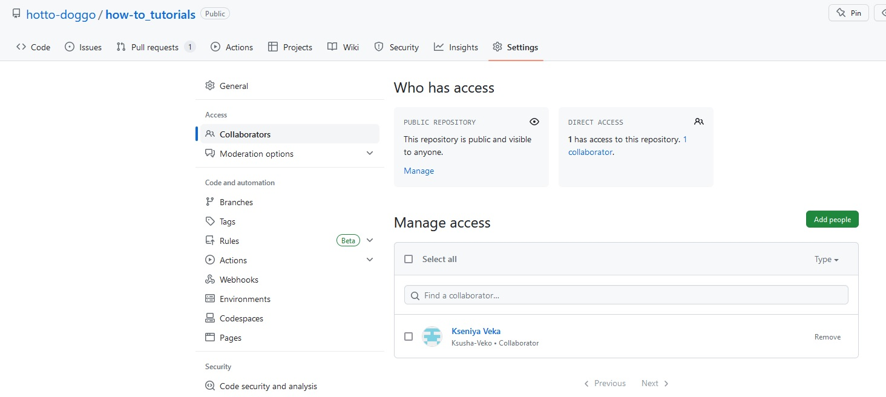
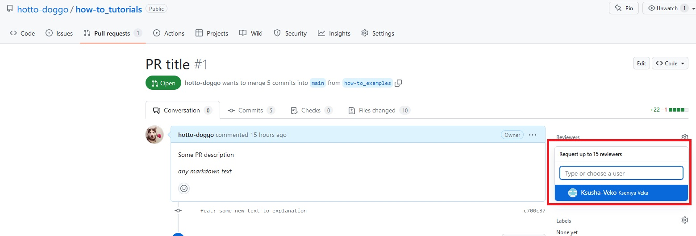

# How to create a Pull Request (PR)

1. Firstly you should create new branch, make some changes and push it to the remote repository (Github).
2. Then you should go to your repo on the Github, chose tab "Pull requests" and press the "New pull request" button.

3. Then you should chose base and source (currently it is named "compare") branch. In our example our target (base) branch is `main`, and source is `how-to_examples`. Base branch is the branch where new changes should be applied, and source is the branch that contains your changes.

Push the "Create pull request" button.
4. Then you will see that you are able to add a title and some description to your PR. Do that and press the "Create pull request" button.

5. In the next steps you'll learn how to add a person to review.Firstly you have to add this person to collaborators.
Make sure that you are on the Settings tab and chose Collaborators.

Then you have to log in.
After that you will be able to add new person to the collaborators. You should know the nick name of the person that you want to add to collaborators.

Wait until this person accept your request.

Also you can ping him/her in some messenger :grin:.

6. Hooray! Now you are able to add a reviewer to your PR :smiley:

